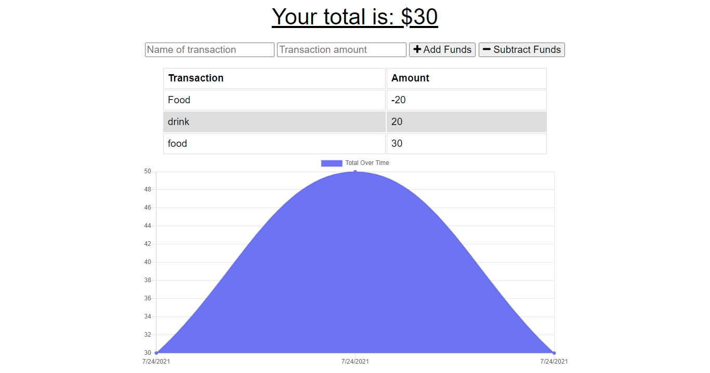

<h1>Budget Tracker</h1>

<h2> Table of Contents </h2>

- [Deployed App](#deployed-app)
- [About the Project](#about-the-project)
- [Getting Started](#getting-started)
  - [Installation](#installation)
  - [Launch the app](#launch-the-app)
- [Questions](#questions)
- [Screenshots](#screenshots)

## Deployed App

This app is currently deployed on Heroku. Please check it out [here](https://salty-castle-64501.herokuapp.com/).

## About the Project

The app uses MongoDB, Mongoose, and Express to allow users to log and keep track of their expenses and displays them on a graph. You can add a transaction byt giving it a name and selecting whether you are adding or subtracting funds.

## Getting Started

### Installation

```
git clone https://github.com/natasha-mann/budget-tracker-pwa.git
cd budget-tracker-pwa
npm i
```

### Launch the app

```

npm run start

```

## Questions

If you have any questions about this application, please contact me by [email](mailto:natasha.s.mann@gmail.com).

## Screenshots


